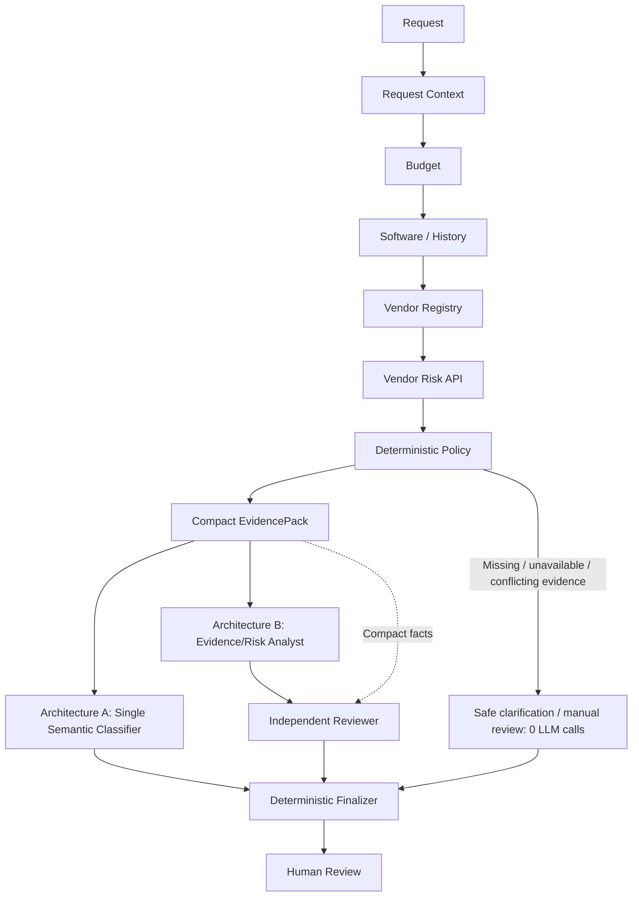

# AI Procurement Request Copilot

An internal procurement-review tool for FDE Assessment 3. It gathers factual
purchase evidence, applies deterministic policy, and recommends the next human
action. It never purchases, grants approval, or changes budgets. All business
data is synthetic and exists only for this assessment.

**MVP decision: ship Architecture A by default.** Both architectures passed the
same six public minimum checks; A uses fewer model calls, is faster, and has
simpler orchestration. B adds useful semantic challenge, but no public quality
gain has been measured. See [the decision memo](docs/architecture_decision.md).

## Local setup and run

Python 3.11 or 3.12 is recommended; the provisioned project was also validated
with Python 3.13. Run commands from the repository root.

**Windows PowerShell**

```powershell
python -m venv .venv
.\.venv\Scripts\Activate.ps1
python -m pip install -r requirements.txt
Copy-Item .env.example .env
```

If activation is blocked by local policy, use `.\.venv\Scripts\python.exe`
in place of `python` without activating the environment.

**macOS / Linux**

```bash
python -m venv .venv
source .venv/bin/activate
python -m pip install -r requirements.txt
cp .env.example .env
```

Fill in `LLM_API_KEY`, `LLM_BASE_URL`, and `LLM_MODEL` in `.env`.
**Never commit `.env`, API keys, or other secrets.** The file is ignored; existing
OS environment variables take precedence over dotenv values. No provider SDK
is needed: the compatible transport uses `requests`.

Use `LLM_PROVIDER=openai-compatible` (also accepts `openai` or `groq`). The base
URL is the API root, such as `https://api.groq.com/openai/v1`, without
`/chat/completions`. Model, credentials, URL, timeout, retries, temperature,
output ceiling, and reasoning effort are runtime settings in `.env.example`.
`LLM_REASONING_EFFORT=low` is the default; set it blank for models/endpoints that
do not support the parameter. Business thresholds are never environment settings.

```bash
python verify_setup.py
python run_local.py
```

`verify_setup.py` checks imports, data, contracts and the in-process mock API
without an LLM key. `run_local.py` starts the supplied vendor-risk API at
`http://127.0.0.1:8001` and Streamlit at `http://127.0.0.1:8501`. Open the UI,
select a request and architecture, and click **Run Analysis**. Ctrl+C stops both
services. The launcher uses these fixed local ports; keep the local
`VENDOR_RISK_API_URL` aligned with port 8001. For a separately hosted API, start
Streamlit with `python -m streamlit run app.py` and configure the service URL.

The UI presents request details, human review routing, approvals, risks, missing
facts, next steps, and evidence/provenance. Telemetry and decision JSON are in
expanders. Changing a selection does not run analysis automatically.

**Optional manual live provider smoke test** (uses provider quota):

```bash
python -m src.provider_smoke
```

This sends a tiny harmless prompt with at most 256 output tokens and no retries.
It prints sanitized pass/fail, is excluded from normal tests, and does not use
procurement data. Reasoning-model truncation fails explicitly; it is not repaired
with a larger automatic request.

## Architecture and deterministic boundaries

The preserved evaluation entry point is
`src.solution.handle_request(request_id, architecture="single")`.
Both paths return the `ProcurementDecision` contract.



The host gathers each source once; arrows summarize host acquisition order,
not model-led tool selection. Compact packing/model reasoning is skipped on
deterministic early exits. Full records and provenance stay on the host.

| Tool | Source / responsibility |
| --- | --- |
| Request context | `requests.json`, `employees.csv`: request, requester, department, manager |
| Department budget | `department_budgets.csv`: available software budget |
| Software/history | `software_catalog.csv`, `purchase_history.csv`: scoped catalog candidates and related purchases |
| Vendor registry | `vendors.csv`: onboarding, security and legal facts |
| External vendor risk | Supplied mock HTTP API; never direct backing-JSON access during business processing |
| Policy evaluation | `src/policy.py`: authoritative checks with policy section references |

Rules are implemented in code from `data/procurement_policy.md`, the documented
business source of truth; Markdown thresholds are not parsed at runtime.
Approval tiers, budget sufficiency, review ages, structured Security/Privacy/Legal
triggers, and explicit missing/unknown states are deterministic. Date checks use
**2026-09-30**, not today's date. This separation keeps stochastic model output
from weakening mandatory business controls.

**Architecture A (`single`)**: complete compact evidence goes to one semantic
recommendation classifier. **Architecture B (`staged`)**: a specialist analyst
classifies existing-tool fit and the stated gap; a fresh independent reviewer
checks those claims against the compact facts and may correct or escalate them.
The reviewer is a distinct role, currently using the same configured model.
Strict typed outputs reject extra fields and inconsistent review classifications.

Both paths use zero model calls when missing, unknown, unavailable or conflicting
material facts establish a safe handoff. Otherwise A uses at most one call and B
at most two. Each semantic call caps output at **256 tokens** (or a smaller global
`LLM_MAX_OUTPUT_TOKENS` ceiling) and disables HTTP retries. There are no retrieval
or repair loops, full-policy prompts, tool schemas, or growing conversation
histories. Static instructions precede dynamic evidence for caching where supported.

`AGENT_MAX_TOOL_CALLS=24` is supported (minimum 6, maximum 40); normal execution
uses six tools. Retired `AGENT_MAX_MODEL_TURNS` is ignored. General transport
requests retain configured retries/output ceilings; the semantic overrides do
not change them. HTTP timeouts apply per-attempt to connection/read inactivity,
not a total workflow deadline.

Telemetry reports actual HTTP attempts, logical calls, tools/names and optional
prompt/completion/cached tokens. Staged token totals become unknown if a stage
omits a metric, rather than reporting a misleading partial total. Zero-call
handoffs report zero tokens. Provider-specific HTTP logic stays isolated from
business policy and tools.

## Evaluation and efficiency

Run offline checks without an LLM or running local API:

```bash
python -m unittest discover -s tests -v
python verify_setup.py
git diff --check
```

For live public evaluation, first run `python run_local.py`, then use a second
terminal with the same environment and configured credentials:

```bash
python evals/run_public_evals.py --architecture single
python evals/run_public_evals.py --architecture staged
```

These commands consume API quota. Six visible cases check minimum expectations,
not full semantic quality. The latest existing local CSVs confirm this comparison:

| Metric | Architecture A: Single | Architecture B: Staged |
| --- | ---: | ---: |
| Public minimum checks passed | 6/6 | 6/6 |
| Average latency | ~0.80 s | ~1.05 s |
| Total LLM calls across six cases | 2 | 4 |
| Average LLM calls/request | 0.33 | 0.67 |
| Average tool calls/request | 6 | 6 |
| Notable public failures | None | None; no material public-check regressions |

A had no 429s after optimization. Public success alone does not prove one
architecture has better semantic quality. B approximately doubles calls on
semantic cases and adds a failure surface; its additional review is an option
when that benefit warrants the cost.

### Why Architecture A changed

The original model-led tool loop averaged **7.17 actual HTTP attempts/request**
and **~46.85 s latency**, with repeated TPM/rate-limit pressure. Model turns were
being spent deciding whether to retrieve evidence that every request requires.
Evidence-first orchestration makes retrieval complete and repeatable, removes
duplicate evidence serialization, and skips unnecessary reasoning. The optimized
run averaged **0.33 calls/request and ~0.80 s**, roughly **95% fewer calls and
98% lower average latency**. A representative live call used **424 prompt + 60
completion = 484 total tokens**. The full public run stayed comfortably below
the tested Groq **8K TPM** limit. These are supplied historical validation metrics,
not a guarantee about current provider limits or other workloads.

### Manual non-public validation

- REQ-1004: customer PII plus integration preserved Security/Privacy/Legal routing.
- REQ-1007: expired/conflicting vendor evidence caused safe manual review with
  zero model calls in both architectures.
- REQ-1008: legitimate TaskFlow overlap remained detected.
- REQ-1010: vendor-only SignFlow similarity exposed a false overlap flag. The
  generic fix requires an exact product or category candidate match; vendor-only
  similarity remains history/context. Manual revalidation confirmed no overlap
  for the training pack and preserved TaskFlow overlap. Regression tests cover it.

`evals/results_single.csv` and `evals/results_staged.csv` remain ignored local,
regenerable outputs. README and the memo contain the submission comparison;
retain both CSVs locally as supporting evidence. The checklist/eval instructions
require comparison evidence but do not mandate tracked CSVs.

## Safety and limitations

Request/vendor/tool strings are untrusted business data. Injection detection is
heuristic; enforceable safety comes from deterministic controls, strict output
validation, read-only tools, and host-owned finalization. The model cannot remove
mandatory approvals/flags, invent provenance, approve a purchase, or execute a
tool. Missing facts request clarification; unavailable/conflicting evidence,
provider failures and malformed/truncated output produce human review without
fabrication. Errors shown in the UI never include raw exceptions or credentials.

The six public minimum checks and synthetic dataset are limited evidence. Hidden
cases and provider behavior may differ. Both staged roles use the same model;
role independence is not independent model diversity. Product/category overlap
is exact candidate matching, not fuzzy equivalence or proof of spare capacity.
Provider caching and 256-token sufficiency vary by model. A fresh-environment installation and final browser walkthrough were manually validated before submission.

## Project structure

```text
data/                         Synthetic records, dictionary and documented policy
mock_api/                     Supplied vendor-risk service (owns backing risk JSON)
src/policy.py                 Deterministic rules with policy reference metadata
src/tools.py                  Six read-only evidence tools and provenance
src/evidence_pack.py          Compact typed model input
src/single_agent.py           Architecture A and deterministic finalizer
src/staged_agent.py           Architecture B analyst / reviewer
src/provider.py               Provider-neutral interface
src/openai_compatible.py       Compatible HTTP transport
src/config.py                 Environment-based runtime configuration
src/contracts.py              ProcurementDecision and telemetry
src/solution.py               Stable evaluation adapter
app.py                        Streamlit procurement-review interface
run_local.py                  Local API/UI launcher
verify_setup.py               Offline preflight
tests/                       Offline policy, tools, transport, agent and UI checks
evals/                        Public cases, runner, comparison instructions
docs/                         Assignment brief and architecture decision memo
templates/                    Required memo/evaluation structures
```

If startup fails, confirm the environment, run preflight, check ports 8001/8501,
and check the configured endpoint/model. Install requirements in your own
project environment; no new model SDK or frontend framework is required.
